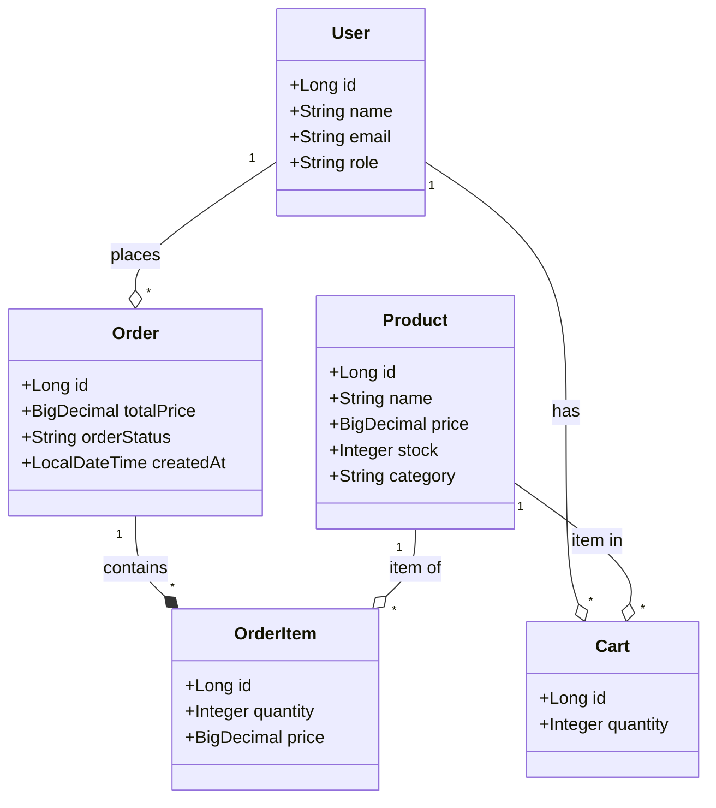
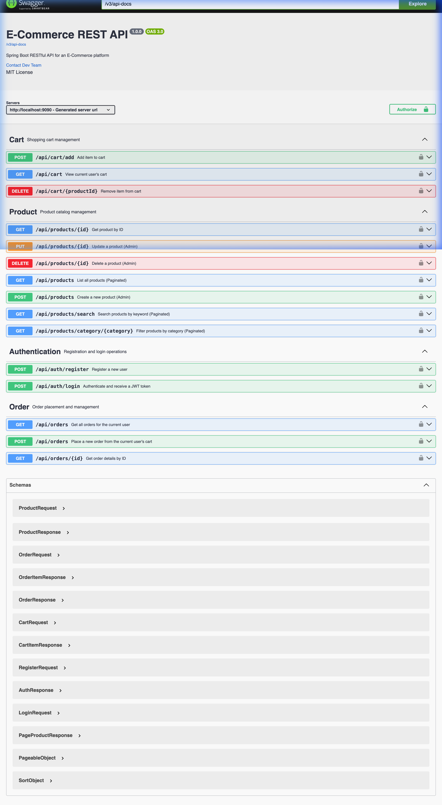

# Spring Boot E-Commerce RESTful API

A robust and scalable e-commerce backend built with Spring Boot, providing a complete set of RESTful endpoints for user authentication, product management, shopping cart operations, and order processing.

---

## 🚀 Key Features

- **User Authentication & Authorization**: Secure JWT-based authentication with role-based access control (ADMIN/USER).
- **Product Management**: Full CRUD operations for products, including search and category filtering.
- **Shopping Cart**: Manage items in a persistent shopping cart for each user.
- **Order Processing**: Seamless transition from cart to order with total price calculation and status tracking.
- **API Documentation**: Automatically generated interactive API documentation using Swagger UI and OpenAPI 3.
- **Data Seeding**: Automatic population of sample users and products at startup for easy testing.
- **Database Integration**: Seamless integration with MySQL for production and H2 (In-memory) for testing.

---

## 🛠️ Technology Stack

- **Core Framework**: Spring Boot 3.2.3
- **Security**: Spring Security & JSON Web Token (JWT)
- **Data Access**: Spring Data JPA & Hibernate
- **Database**: MySQL (Production), H2 (Testing)
- **Documentation**: SpringDoc OpenAPI (Swagger UI)
- **Build Tool**: Maven
- **Utilities**: Lombok

---

## 📊 Visual Architecture

The following diagram illustrates the core entity relationships within the system:



---

## 📖 API Documentation

This project uses **Swagger UI** for interactive API documentation. You can explore and test all available endpoints through a user-friendly interface.

### Swagger UI Screenshot


### Accessing Documentation
Once the application is running, the documentation is available at:
- **Swagger UI**: `http://localhost:8080/swagger-ui.html`
- **OpenAPI JSON**: `http://localhost:8080/v3/api-docs`

---

## ⚙️ Getting Started

### Prerequisites
- Java 21 or higher
- Maven 3.x
- MySQL Server

### Configuration
1. Create a MySQL database named `ecommerce_db`.
2. Update the credentials in `src/main/resources/application.properties`:
   ```properties
   spring.datasource.url=jdbc:mysql://localhost:3306/ecommerce_db
   spring.datasource.username=your_username
   spring.datasource.password=your_password
   ```

### Running the Application
```bash
mvn spring-boot:run
```

### Running Tests
```bash
mvn test
```

---

## 🌱 Sample Data
Upon startup, the `DataInitializer` class automatically seeds the database with:
- **1 Admin User**: `admin@ecommerce.com`
- **2 Test Users**: `alice@example.com`, `bob@example.com`
- **10 Sample Products**: Ranging from Electronics to Apparel.

---

## ⚖️ License
This project is licensed under the MIT License - see the [LICENSE](LICENSE) file for details.